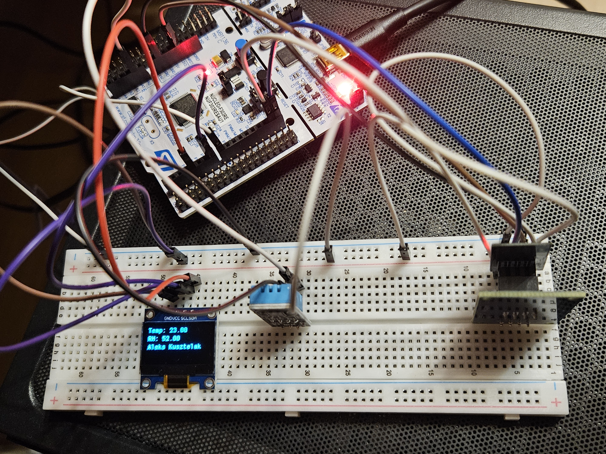
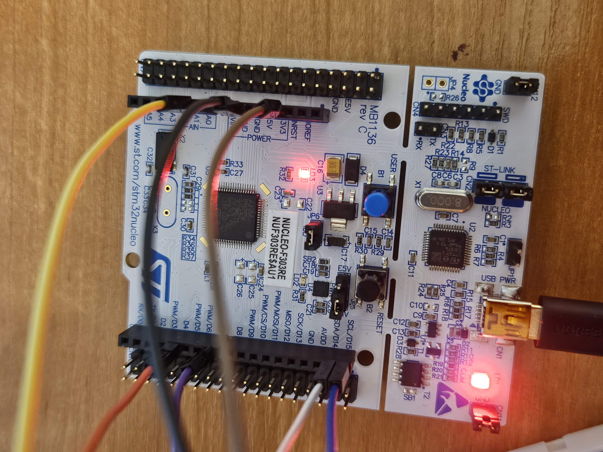
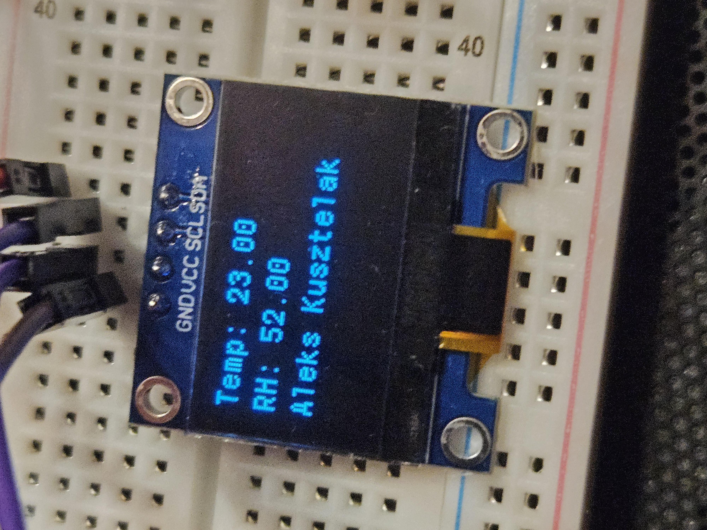
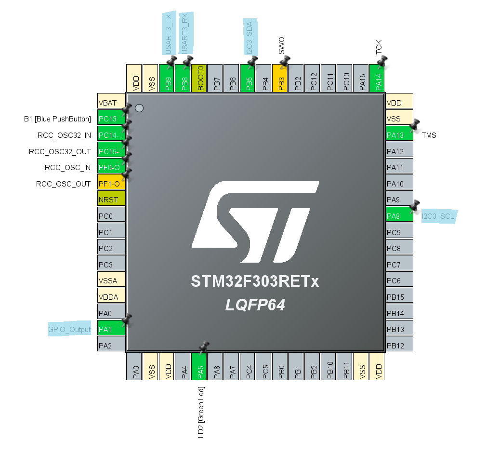
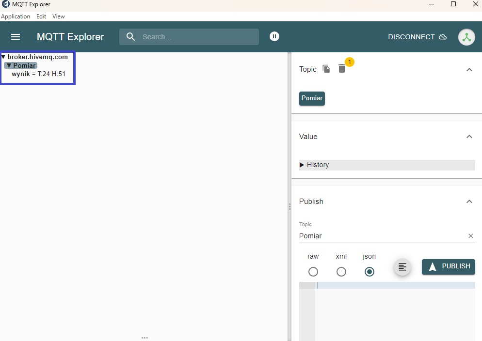

# STM32 IoT Weather Station

An embedded IoT weather station developed as part of my Engineering Thesis in Telecommunications.

The system is based on an **STM32F303RE** microcontroller and measures temperature and relative humidity using a **DHT11 sensor**. Measurements are displayed locally on an **SSD1306 OLED display** and transmitted over Wi-Fi to an **MQTT broker** using an **ESP8266-01** module.



## Development Note

This project was developed and experimentally modified during my Engineering Thesis. Since the code has not been actively maintained for some time, some sections may contain experimental or redundant code and could benefit from refactoring.

## System Architecture

```text
                    ┌──────────────┐
                    │    DHT11     │
                    │ Temperature  │
                    │  & Humidity  │
                    └──────┬───────┘
                           │ GPIO
                           ▼
                    ┌──────────────┐
                    │ STM32F303RE  │
                    │   Cortex-M4  │
                    │      C       │
                    │     HAL      │
                    └───┬──────┬───┘
                        │      │
                    I²C │      │ USART3
                        ▼      ▼
                 ┌──────────┐ ┌───────────┐
                 │ SSD1306  │ │ ESP8266-01│
                 │   OLED   │ │   Wi-Fi   │
                 └──────────┘ └────┬──────┘
                                   │
                                Wi-Fi/TCP
                                   │
                                   ▼
                            ┌─────────────┐
                            │ MQTT Broker │
                            │   HiveMQ    │
                            └──────┬──────┘
                                   │ MQTT
                                   ▼
                            ┌─────────────┐
                            │ MQTT Client │
                            └─────────────┘
```

## Features

- Temperature and humidity measurement using DHT11
- Local measurement display using an SSD1306 OLED
- I²C communication between STM32 and the OLED
- Microsecond timing using TIM6
- USART3 communication between STM32 and ESP8266-01
- ESP8266 control using AT commands
- Wi-Fi station-mode connectivity
- TCP connection to an MQTT broker
- MQTT 3.1.1 communication
- Publishing measurements to an MQTT topic
- Remote monitoring using an MQTT desktop client
- USART1 debug output using `printf()`

## Hardware

| Component | Purpose |
|---|---|
| STM32 NUCLEO-F303RE | Main microcontroller |
| DHT11 | Temperature and humidity sensor |
| SSD1306 OLED 128×64 | Local data visualization |
| ESP8266-01 | Wi-Fi connectivity |
| ESP-01 adapter | ESP8266 integration |
| Breadboard | Hardware prototyping |





## Software & Technologies

- **C**
- **STM32CubeIDE**
- **STM32CubeMX**
- **STM32 HAL**
- **GPIO**
- **I²C**
- **USART / UART**
- **Hardware timers**
- **ESP8266 AT commands**
- **Wi-Fi**
- **TCP/IP**
- **MQTT 3.1.1**

## STM32 Configuration

The STM32F303RE peripherals were configured using **STM32CubeMX**.

The project uses:

| Peripheral | Function |
|---|---|
| GPIO | DHT11 communication |
| TIM6 | Microsecond timing for DHT11 |
| I²C3 | SSD1306 OLED communication |
| USART3 | ESP8266 communication |
| USART1 | Debug / `printf()` output |

The complete STM32CubeMX configuration is included in:

```text
StacjaPogodowaINZ.ioc
```



## Communication Interfaces

### DHT11 — GPIO

The DHT11 communicates with the STM32 using a single GPIO data line.

Because the protocol depends on precise timing, **TIM6** is used to provide microsecond-level timing required by the DHT11 communication protocol.

The sensor transmits five bytes:

```text
Humidity integer
Humidity decimal
Temperature integer
Temperature decimal
Checksum
```

The firmware calculates the checksum from the first four bytes and compares it with the checksum transmitted by the sensor.

Only measurements that pass checksum validation are used for display and MQTT publishing.

### OLED — I²C3

An SSD1306-based 128×64 OLED provides local visualization of the measurements.

The display communicates with the STM32 using **I²C3**.

Displayed information includes temperature and relative humidity.

Example:

```text
Temp: 23
RH:   52
```

### ESP8266-01 — USART3

The ESP8266-01 communicates with the STM32 using **USART3** configured for asynchronous communication at:

```text
115200 baud
8 data bits
No parity
1 stop bit
TX/RX
```

The STM32 communicates with the ESP8266 using AT commands.

Commands used by the ESP8266 communication layer include operations such as:

```text
AT
ATE0
AT+CWMODE
AT+CWJAP
AT+CIFSR
AT+CIPSTART
AT+CIPSEND
```

These commands are used to initialize the module, configure Wi-Fi connectivity and establish TCP communication.

### Debug Interface — USART1

The project also uses **USART1** for debugging.

Standard C `printf()` output is redirected to USART1 using STM32 HAL:

```c
int _write(int file, char *ptr, int len)
{
    HAL_UART_Transmit(&huart1, (uint8_t *)ptr, len, 100);
    return len;
}
```

This provides serial debug output during development and communication with the ESP8266.

## Wi-Fi Configuration

The ESP8266 operates in Wi-Fi station mode and connects to an access point before establishing the MQTT connection.

The public repository does **not** contain real Wi-Fi credentials.

Placeholder values are used instead:

```c
ESP_ConnectWiFi(
    "XYZ",
    "XYZ",
    ip_buf,
    sizeof(ip_buf)
);
```

## MQTT Communication

The weather station communicates using **MQTT 3.1.1**.

After establishing Wi-Fi connectivity, the ESP8266 opens a TCP connection to the public HiveMQ MQTT broker:

```text
Host: broker.hivemq.com
Port: 1883
```

The firmware connects using the MQTT client identifier:

```text
STM32Client
```

Measurements are published to:

```text
Pomiar/wynik
```

Example payload:

```text
T:23 H:52
```

Before publishing, the application checks whether the TCP connection is still available.

Conceptually:

```c
if (ESP_CheckTCPConnection() == ESP8266_OK)
{
    ESP_MQTT_Publish("Pomiar/wynik", tempStr, 0);
}
```

The MQTT packets are transmitted through the ESP8266 TCP connection.

## MQTT Verification

A desktop MQTT client was used to subscribe to the measurement topic and verify successful end-to-end communication.



The complete data path is:

```text
DHT11
  │
  ▼
STM32F303RE
  │
  │ USART3
  ▼
ESP8266-01
  │
  ▼
Wi-Fi / TCP
  │
  ▼
HiveMQ MQTT Broker
  │
  │ MQTT
  ▼
MQTT Client
```

## Program Flow

The application follows this general sequence:

```text
Power On
   │
   ▼
Initialize STM32 peripherals
   │
   ▼
Initialize ESP8266
   │
   ▼
Connect to Wi-Fi
   │
   ▼
Connect to HiveMQ MQTT broker
   │
   ▼
Start TIM6
   │
   ▼
Read DHT11
   │
   ▼
Calculate and validate checksum
   │
   ├── Invalid ──► Ignore measurement
   │
   ▼
Display measurement on OLED
   │
   ▼
Create MQTT payload
   │
   ▼
Check TCP connection
   │
   ├── Disconnected ──► Skip transmission
   │
   ▼
Publish to Pomiar/wynik
   │
   ▼
Repeat
```

## Repository Structure

```text
STM32_WeatherStation_Basic/
│
├── Core/
│   ├── Inc/
│   ├── Src/
│   └── Startup/
│
├── Drivers/
│   ├── 8266_1/
│   │   ├── ESP8266_STM32.c
│   │   └── ESP8266_STM32.h
│   │
│   ├── DHT11/
│   ├── OLED/
│   ├── CMSIS/
│   └── STM32F3xx_HAL_Driver/
│
├── images/
│
├── StacjaPogodowaINZ.ioc
├── STM32F303RETX_FLASH.ld
├── README.md
└── .gitignore
```

### Important Project Files

- `Core/` — application code and STM32 peripheral initialization
- `Drivers/8266_1/` — ESP8266 communication layer
- `Drivers/DHT11/` — DHT11-related code
- `Drivers/OLED/` — SSD1306 OLED support
- `Drivers/CMSIS/` — ARM/STMicroelectronics CMSIS components
- `Drivers/STM32F3xx_HAL_Driver/` — STM32 HAL drivers
- `StacjaPogodowaINZ.ioc` — STM32CubeMX hardware and peripheral configuration
- `STM32F303RETX_FLASH.ld` — linker script defining the STM32F303RE FLASH/RAM memory layout

Generated build artifacts such as the `Debug/` directory are not included in the repository.

## Third-Party Components

This project combines project-specific application code, STM32-generated code and selected third-party components.

### ESP8266 Communication Layer

The ESP8266 communication files located in:

```text
Drivers/8266_1/
├── ESP8266_STM32.c
└── ESP8266_STM32.h
```

are based on the **ControllersTech STM32 ESP8266 library** and were integrated and adapted for use in this project.

The communication layer provides functionality used by the weather station for:

- sending ESP8266 AT commands,
- USART communication with the module,
- Wi-Fi connection management,
- TCP connection establishment,
- data transmission using `AT+CIPSEND`,
- MQTT communication.

Original attribution and licensing information is preserved in the source files.

### SSD1306 OLED Library

The project uses an external SSD1306 display library for low-level OLED functionality.

The library was integrated with the weather-station application to display measurements obtained from the DHT11.

### STM32 HAL

Peripheral configuration and hardware access use the **STM32 Hardware Abstraction Layer (HAL)** provided by STMicroelectronics.

Parts of the initialization code were generated using STM32CubeMX / STM32CubeIDE.

## Engineering Thesis

This project was developed as part of my Engineering Thesis

The objective was to design and implement an IoT weather station capable of measuring environmental parameters, displaying them locally and making the measurements available remotely using Wi-Fi and MQTT.

## Skills Demonstrated

This project demonstrates practical experience with:

- Embedded C development
- STM32 microcontrollers
- STM32CubeMX peripheral configuration
- STM32 HAL
- GPIO
- I²C
- UART / USART
- Hardware timers
- Timing-sensitive sensor communication
- DHT11 data acquisition and checksum validation
- SSD1306 OLED integration
- ESP8266 integration and adaptation
- AT command communication
- Wi-Fi connectivity
- TCP/IP fundamentals
- MQTT publish/subscribe communication
- Embedded debugging
- Hardware/software integration
- IoT system architecture
- Technical documentation


